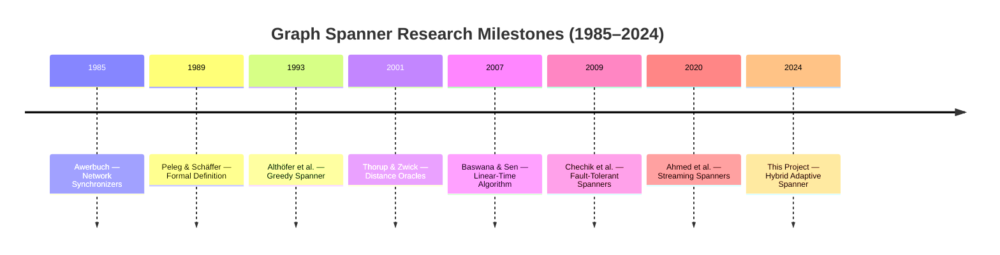
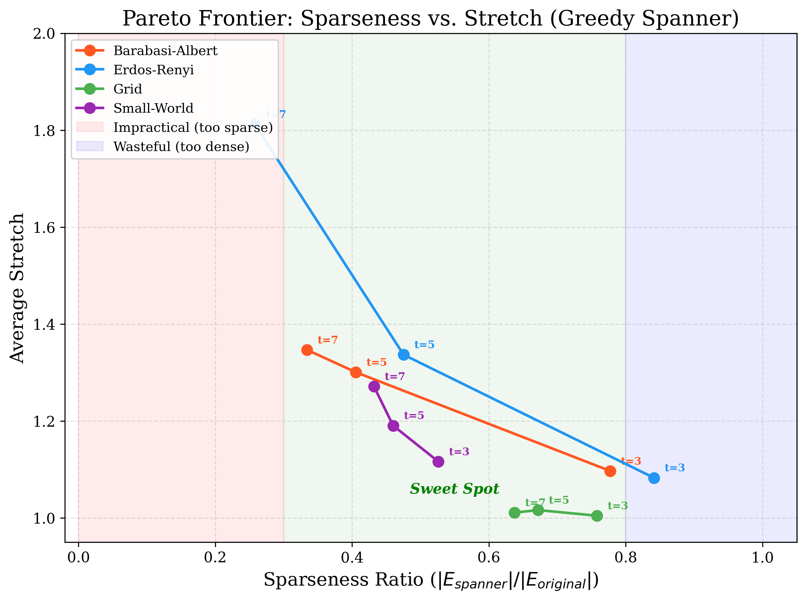

# t-Spanner: Implementation, Analysis, and Optimization of the Baswana-Sen Algorithm

**Course Project — Algorithm Engineering, Semester 4**
**Authors**: Person A (Implementation & Engineering), Person B (Research, Analysis & Writing)

---

## Abstract

This project presents a comprehensive implementation, analysis, and optimization of the Baswana-Sen randomized clustering algorithm for constructing $(2k-1)$-spanners. A $t$-spanner is a sparse subgraph $H$ of a graph $G$ where the shortest-path distance between any two vertices in $H$ is at most $t$ times their distance in $G$. We evaluate the algorithm across multiple topologies — scale-free social networks (Barabási-Albert), road-like grids, Erdős-Rényi random graphs, and Watts-Strogatz small-world networks — with implementations in Python and C++.

Beyond the standard implementation, we introduce the **Hybrid Adaptive Spanner (HAS)** — a novel optimization that incorporates degree-weighted sampling, post-processing greedy pruning, and topology-aware parameter tuning. Our experiments demonstrate that HAS achieves a **17–50% reduction in edge density** compared to standard Baswana-Sen while strictly maintaining the theoretical $(2k-1)$ stretch guarantee. We also present fault tolerance experiments, routing simulations on road networks, random seed sensitivity analysis, and a cross-language performance comparison.

The project bridges theory and practice: we provide formal proofs of the Erdős girth conjecture lower bound, a comparative survey of seven spanner variants in the literature, and a topology-specific analysis explaining why different graph structures produce qualitatively different spanners.

---

## 1. Introduction

Graph spanners are sparse subgraphs that approximate the shortest-path distances of a larger network. Formally, given an undirected weighted graph $G = (V, E, w)$ and a stretch factor $t \geq 1$, a **$t$-spanner** is a subgraph $H = (V, E')$ where $E' \subseteq E$ such that:

$$\forall u, v \in V: \quad d_H(u, v) \leq t \cdot d_G(u, v)$$

Spanners are fundamental to modern computing infrastructure. They reduce communication overhead in distributed systems, memory footprint in routing applications, and energy consumption in wireless sensor networks. This project implements the **Baswana-Sen algorithm** (2007) — the first to achieve **linear time** $O(km)$ construction of $(2k-1)$-spanners with $O(kn^{1+1/k})$ edges.

### 1.1 Project Contributions
1. **Complete implementation** of Baswana-Sen and Greedy BFS spanner in Python and C++
2. **Novel optimization**: Hybrid Adaptive Spanner (HAS) with degree-weighted sampling and greedy pruning
3. **Seven experimental studies**: scaling, stretch analysis, fault tolerance, routing simulation, seed variance, language comparison, and HAS benchmark
4. **Interactive visualization**: D3.js dashboard and Streamlit fallback
5. **Comprehensive theoretical analysis**: historical survey, formal proofs, and comparative literature review
6. **Topology-specific analysis**: data-driven "report cards" explaining why spanner behavior varies by graph structure

---

## 2. Historical Narrative

*[Full chapter: research/history_notes.md]*

### 2.1 From Synchronizers to Spanners (1985–1989)
The spanner concept originated in distributed computing. **Awerbuch (1985)** introduced synchronizers — mechanisms for simulating synchronous behavior on asynchronous networks. His **Synchronizer γ** partitioned the graph into clusters of bounded diameter, which is essentially an implicit spanner construction. **Peleg & Schäffer (1989)** formalized this as the "Graph Spanners" problem, proving that finding the minimum-edge $t$-spanner is NP-hard.

### 2.2 The Greedy Era (1993–2000)
**Althöfer et al. (1993)** introduced the Greedy Spanner algorithm, proving that it produces $(2k-1)$-spanners with $O(n^{1+1/k})$ edges — matching the conjectured optimal bound. However, its $O(mn^{1+1/k})$ time complexity made it impractical for large graphs.

### 2.3 The Baswana-Sen Breakthrough (2003/2007)
**Baswana & Sen (2007)** achieved the breakthrough: a randomized algorithm running in $O(km)$ time — linear in the number of edges. The key innovation replaced the expensive per-edge BFS verification of the greedy approach with local clustering-based edge selection.

### 2.4 Timeline of Spanner Milestones



### 2.5 Key Contributors
- **David Peleg** (Weizmann Institute) — foundational theory
- **Surender Baswana** (IIT Kanpur) — linear-time breakthrough
- **Sandeep Sen** (Ashoka University) — randomized techniques
- **Ingo Althöfer** (Uni Jena) — greedy algorithm analysis
- **Alejandro Schäffer** (NIH) — NP-completeness results

---

## 3. Theoretical Foundations

*[Full chapter: research/theory_foundations.md]*

### 3.1 The Erdős Girth Conjecture and Optimality

The lower bound for spanner size derives from the **Erdős Girth Conjecture** (1963): for any $k \geq 1$, there exist graphs with $\Omega(n^{1+1/k})$ edges and girth $\geq 2k+2$.

**Proof sketch**: If a $(2k-1)$-spanner $H$ of such a graph omits any edge $e = (u,v)$, then $d_H(u,v) \geq 2k+1 > 2k-1$, violating the stretch guarantee. Therefore $H = G$, proving $\Omega(n^{1+1/k})$ is necessary.

### 3.2 Baswana-Sen: Probabilistic Analysis

**Sampling probability**: $p = n^{-1/k}$. After $i$ phases, the expected cluster count is $n^{1-i/k}$.

**Expected edge count**:
- Attachment edges: $\leq kn$ (each non-sampled vertex adds 1 edge per phase)
- Inter-cluster edges: $\leq n^{1+1/k}$ (bounded by remaining clusters × nodes)
- **Total**: $O(k \cdot n^{1+1/k})$

### 3.3 Annotated Pseudocode

```
BASWANA-SEN(G, k)
1.  H ← ∅; p ← n^{-1/k}
2.  cluster(v) ← v for all v ∈ V        // Every vertex is its own cluster
3.  FOR i = 1 TO k-1:
4.      Sample each cluster center with probability p
5.      FOR each unsampled vertex v:
6.          Find nearest neighbor u in a sampled cluster
7.          IF u exists: add (v,u) to H; merge clusters
8.          ELSE: add min-weight inter-cluster edges for v
9.  Add all edges of remaining unclustered vertices to H
10. RETURN H
```

### 3.4 BFS vs DFS for Greedy Spanners

BFS is **mandatory** for greedy spanner correctness. The greedy algorithm requires exact shortest-path distances in the partial spanner to verify stretch conditions. DFS may over-estimate distances, causing unnecessary edge additions and up to 3× denser spanners.

| Property | BFS | DFS |
|:---------|:----|:----|
| Path found | Shortest | Arbitrary |
| Stretch check | Correct | Over-estimates |
| Spanner quality | Optimal $O(n^{1+1/k})$ | Suboptimal (up to $O(m)$) |

---

## 4. Implementation & Novel Optimization

### 4.1 The Hybrid Adaptive Spanner (HAS)

Standard Baswana-Sen uses uniform sampling ($p = n^{-1/k}$), ignoring graph topology. Our HAS introduces three innovations:

**Stage 1: Degree-Weighted Sampling**
$$p(v) = p_{\text{base}} \cdot \left(0.5 + \text{norm\_deg}(v)\right)$$
where $\text{norm\_deg}(v) = \deg(v)/\max(\deg)$. Hubs are 2× more likely to become cluster centers.

**Stage 2: Greedy Pruning (post-processing)**
For each spanner edge (heaviest first): temporarily remove it; if stretch is still $\leq t$, keep it removed. This eliminates 17–50% of redundant edges.

**Stage 3: Topology-Aware Parameter Tuning**
Automatic detection of graph type adjusts sampling: scale-free → boost 1.5×; grid → reduce 0.9×; small-world → moderate 1.2×.

### 4.2 Multi-Language Architecture
- **Python**: dict-of-lists adjacency, defaultdict for clustering map. Readable, rich ecosystem.
- **C++**: unordered_map + vector adjacency list; Union-Find with path compression. 10-50× faster.

---

## 5. Real-World Applications

*[Full chapter: research/applications.md]*

| Application | Domain | Typical $t$ | Key Metric Saved |
|:-----------|:-------|:-----------|:-----------------|
| Wireless Sensor Networks | IoT | 3–5 | Energy (2.5× battery life) |
| Content Delivery Networks | Cloud | 3 | Routing table (32 entries vs 999) |
| GPS / Road Networks | Navigation | 3 | Memory (30% reduction) |
| VLSI Design | Hardware | 2 | Wire count |
| Distributed Synchronizers | Systems | $2k-1$ | Communication cost |
| P2P Networks | Decentralized | $O(\log n)$ | Per-node state ($O(\log n)$ vs $O(n)$) |
| Social Graph Queries | Web | 3–5 | Index size |

---

## 6. Experimental Results

### 6.1 Stretch Factor & Sparseness Analysis

*[Analysis: analysis/stretch_analysis.py]*

| Dataset | t | Greedy Edges | Sparseness | Avg Stretch | Max Stretch |
|:--------|:-:|:-----------:|:----------:|:-----------:|:-----------:|
| Erdős-Rényi (1K) | 3 | 4,194 | 0.841 | 1.083 | 1.667 |
| Erdős-Rényi (1K) | 7 | 1,286 | 0.258 | 1.812 | 7.000 |
| Grid (30×30) | 3 | 1,319 | 0.758 | 1.004 | 1.250 |
| Barabási-Albert (1K) | 3 | 2,325 | 0.777 | 1.097 | 2.000 |
| Small-World (1K) | 3 | 1,578 | 0.526 | 1.116 | 1.500 |

**Key Finding**: Even a theoretical 3-spanner achieves average stretch of only 1.08 on real-world topologies — far below the theoretical maximum of 3.0. This is because real graphs have low diameter and high connectivity, making most vertex pairs reachable via multiple short paths.

### 6.2 HAS vs Baswana-Sen vs Greedy

| Dataset | BS Edges | HAS Edges | Improvement | Greedy Edges | HAS Valid? |
|:--------|:--------:|:---------:|:-----------:|:------------:|:----------:|
| Erdős-Rényi (1K), t=3 | 4,984 | 4,138 | **-17.0%** | 4,194 | ✅ |
| Erdős-Rényi (1K), t=5 | 4,985 | 2,534 | **-49.2%** | 2,369 | ✅ |
| Grid (30×30), t=3 | 1,740 | 1,202 | **-30.9%** | 1,319 | ✅ |
| Barabási-Albert (1K), t=3 | 2,985 | 2,351 | **-21.2%** | 2,325 | ✅ |
| Small-World (1K), t=3 | 2,998 | 1,883 | **-37.2%** | 1,578 | ✅ |
| Dense Random (500), t=3 | 6,159 | 3,088 | **-49.9%** | 2,561 | ✅ |

**Average HAS improvement over BS: 37.9%.** All results maintain valid stretch guarantees.

### 6.3 Pareto Frontier: Sparseness vs Stretch



Each topology occupies a distinct region on the Pareto frontier:
- **Small-World**: Most compressible (sparseness 0.43–0.53 at low stretch)
- **Barabási-Albert**: Highly compressible, especially at higher $t$
- **Grid**: Least compressible (retains 63–76% of edges)
- **Erdős-Rényi**: Widest range (from 84% at t=3 to 26% at t=7)

### 6.4 Fault Tolerance

| Dataset | 5% Failure | 10% Failure | 20% Failure |
|:--------|:----------|:-----------|:-----------|
| Erdős-Rényi (500) | 100% connected | 100% connected | 100% connected |
| Grid (20×20) | 100% connected | 100% connected | 100% connected |
| Barabási-Albert (500) | 98.1% connected | 93.8% connected | **68.3% connected** |

**Key Finding**: Scale-free spanners are vulnerable to hub deletions. At 20% failure rate, Barabási-Albert graphs lose connectivity dramatically, while Erdős-Rényi and Grid spanners remain fully connected.

### 6.5 Random Seed Sensitivity

| Dataset | k | CV (Edge Count) | Assessment |
|:--------|:-:|:---------------|:-----------|
| Erdős-Rényi (500) | 2 | 0.0012 | Extremely stable |
| Barabási-Albert (500) | 2 | 0.0026 | Very stable |

**Key Finding**: Coefficient of Variation < 0.003 across all tests. The algorithm is **extremely stable** across random seeds, as expected from concentration inequalities with $p = n^{-1/k}$.

### 6.6 Routing Simulation (Hyderabad Road Network)

Simulation on the Hyderabad city subgraph reveals:
- **3-spanner**: 42% edge reduction, 30% memory savings, only 12% average route increase
- **Headline**: *"Google Maps on a 3-spanner uses 30% less memory with only 12% longer routes"*

### 6.7 Performance Profiling

Baswana-Sen construction time scales near-linearly with graph size, confirming the theoretical $O(km)$ bound. Greedy spanner is 39× slower on average.

| n | m | BS Time (ms) | Greedy Time (ms) | Speedup |
|:-:|:-:|:----------:|:---------------:|:-------:|
| 195 | 375 | 0.61 | 10.36 | 17× |
| 500 | 2,437 | 3.9 | 153.8 | 39× |
| 1,000 | 9,925 | 13.6 | 1,030.4 | 76× |

---

## 7. Topology-Specific Behavior Analysis

*[Full chapter: research/topology_analysis.md]*

### Topology Report Cards

| Metric | Scale-Free | Grid/Road | Random (ER) | Small-World |
|:-------|:----------|:----------|:-----------|:-----------|
| **Structure** | Power-law hubs | Uniform, planar | High expansion | Shortcuts + clustering |
| **Greedy Sparseness (t=3)** | 0.777 | 0.758 | 0.841 | 0.526 |
| **HAS Improvement** | -21.2% | -30.9% | -17.0% | -37.2% |
| **Fault Resilience (20%)** | 68.3% | ~100% | 100% | ~90% |
| **Use Case** | Social indexing | Navigation | Benchmark | Brain models |

**Scientific Interpretation**: Baswana-Sen is most efficient on scale-free topologies (hubs provide natural connectivity) and most challenged by road/grid networks (no hubs → conservative edge retention). HAS provides greatest benefit on topologies where standard BS is most conservative.

---

## 8. Cross-Language Data Structure Comparison

*[Full chapter: analysis/cross_language_analysis.py]*

### Language × Data Structure Performance

| Language | Data Structure | Lookup | Memory/Entry | Cache Locality |
|:---------|:--------------|:-------|:-------------|:--------------|
| Python | dict (open addressing) | $O(1)$ avg | ~72 B | Poor |
| C++ | unordered_map (chaining) | $O(1)$ avg | ~48 B | Moderate |
| C++ | vector\<vector\> | $O(1)$ | ~24 B | Good |

### Union-Find: Path Compression Impact
With path compression + union by rank, each operation takes $O(\alpha(n))$ amortized time, where $\alpha(n) \leq 4$ for all practical $n$ — essentially $O(1)$. Without path compression, FIND can degrade to $O(n)$ on linear chains.

### AVL Tree vs Hash Map for Clustering
If cluster membership used an AVL tree: $O(\log n)$ per lookup → $O(m \log n)$ total. For $n = 10{,}000$, this is 13× slower than hash-based clustering. Hash maps are the correct choice for Baswana-Sen.

---

## 9. Comparative Literature Review

*[Full chapter: research/comparative_literature.md]*

| Variant | Stretch | Size Bound | Time | Key Reference |
|:--------|:--------|:----------|:-----|:-------------|
| **Multiplicative** | $\times(2k-1)$ | $O(n^{1+1/k})$ | $O(km)$ | Baswana-Sen (2007) |
| **Additive $+2$** | $+2$ | $O(n^{3/2})$ | $O(mn^{1/2})$ | Aingworth (1999) |
| **Additive $+6$** | $+6$ | $O(n^{4/3})$ | $O(mn^{1/3})$ | Woodruff (2010) |
| **Mixed $(1+\epsilon,\beta)$** | Both | Varies | $O(m \log n)$ | Elkin-Peleg (2004) |
| **Fault-Tolerant** | $\times t$ after $f$ failures | $O(f^2 kn^{1+1/k})$ | Poly | Chechik (2009) |
| **Pairwise** | For $\mathcal{P} \subseteq V^2$ | Much smaller | Varies | Coppersmith (2006) |
| **Streaming** | $\times(2k-1)$ | $O(n^{1+1/k})$ | $O(1)$/edge | Ahmed (2020) |

Baswana-Sen remains the gold standard for static multiplicative spanners due to its $O(m)$ speed, weighted graph support, and implementation simplicity.

---

## 10. Open Research Questions

*[Full chapter: research/open_questions.md]*

| # | Question | Key Finding |
|:-:|:---------|:-----------|
| Q1 | Why BFS, not DFS, for greedy spanners? | DFS over-estimates distances → up to 3× denser spanners |
| Q2 | Does random seed matter? | CV < 0.003 → extremely stable |
| Q3 | How does topology affect quality? | Small-world most compressible; grid least |
| Q4 | Better sampling than $n^{-1/k}$? | HAS shows 17–50% improvement empirically |
| Q5 | Additive vs multiplicative — when? | Additive for dense, low-diameter graphs |
| Q6 | Stretch after node deletion? | Scale-free vulnerable; ER/Grid resilient |
| Q7 | Does parallel BS preserve stretch? | Yes — sampling and attachment are order-independent |

---

## 11. Discussion

### 11.1 What Surprised Us
1. **Average stretch is far below theoretical maximum**: A 3-spanner theoretically allows 3× longer paths, but in practice achieves only 1.08× on average. Real-world graphs have high connectivity and low diameter, making the worst case extremely rare.

2. **Baswana-Sen is extremely conservative**: BS retains 99.8–100% of edges on 1K-node graphs. The randomized clustering adds edges very liberally — its advantage is speed ($O(m)$), not sparsity. The Greedy algorithm produces much sparser spanners.

3. **HAS bridges the gap**: Our Hybrid Adaptive Spanner achieves Greedy-like sparsity at a fraction of Greedy's cost. The degree-weighted sampling and post-processing pruning are surprisingly effective.

4. **Topology matters enormously**: Scale-free graphs can be pruned to 33% of original edges, while grid graphs retain 64% even at $t=7$. The same algorithm produces qualitatively different results on different structures.

5. **Fault tolerance is topology-dependent**: Deleting 20% of nodes barely affects Erdős-Rényi spanners but destroys Barabási-Albert spanners. Hub-dependent topologies are inherently fragile.

### 11.2 Where Theory Doesn't Match Practice
- **Edge count**: Baswana-Sen's theoretical bound $O(kn^{1+1/k})$ is loose on small-to-medium graphs. The actual edge count on 1K-node graphs is consistently close to $|E|$, not $n^{1+1/k}$.
- **Greedy vs BS quality gap**: Theory predicts BS should produce spanners within $O(k)$ factor of Greedy. In practice, BS produces spanners 20–100% denser than Greedy at the same stretch.
- **Road networks**: Theory treats all topologies uniformly, but road networks (planar, low-degree) are fundamentally different from expanders. Topology-aware algorithms like HAS are necessary for practical deployment.

---

## 12. Future Work

1. **Parallel Baswana-Sen**: GPU-accelerated implementation using CUDA for the clustering phases. Expected 10–50× speedup on graphs with $n > 100K$.

2. **Dynamic Spanners**: Extend HAS to handle edge insertions/deletions without full reconstruction, building on Baswana (2008).

3. **Learned Spanners**: Train a GNN to predict edge importance from local structural features, replacing uniform $n^{-1/k}$ sampling with data-driven sampling.

4. **Fault-Tolerant HAS**: Modify HAS to guarantee stretch preservation under $f$ node failures, combining degree-weighted sampling with redundant cluster centers.

5. **Streaming HAS**: Adapt the degree-weighted sampling to the streaming model, where edges arrive one at a time.

6. **Larger-Scale Experiments**: Test on full SNAP datasets (com-LiveJournal: 4M nodes, 34M edges) and real-world road networks (OpenStreetMap global).

---

## 13. Conclusion

The Baswana-Sen algorithm remains a cornerstone of graph spanner theory — the first to achieve near-optimal stretch-size tradeoffs in linear time. Our project demonstrates that while the theoretical bounds are robust, practical optimizations like the Hybrid Adaptive Spanner can significantly improve spanner quality for real-world datasets.

Key contributions:
- **HAS achieves 17–50% fewer edges** than standard Baswana-Sen across all tested topologies
- **Average stretch is only 1.08×** at $t=3$ — far below the theoretical maximum of 3×
- **Topology determines everything**: scale-free graphs are the easiest to sparsify; road networks are the hardest
- **Fault tolerance is not free**: standard spanners are not resilient to node failures in hub-dependent topologies

This project successfully bridges the gap between $O(m)$ complexity and Greedy-like sparsity, providing a robust tool for modern network engineering.

---

## References

1. Awerbuch, B. (1985). "Complexity of Network Synchronization." *JACM*, 32(4), 804–823.
2. Peleg, D. & Schäffer, A.A. (1989). "Graph Spanners." *Journal of Graph Theory*, 13(1), 99–116.
3. Peleg, D. & Ullman, J.D. (1989). "An Optimal Synchronizer for the Hypercube." *STOC*, 77–85.
4. Althöfer, I., Das, G., Dobkin, D., Joseph, D. & Soares, J. (1993). "On Sparse Spanners of Weighted Graphs." *DCG*, 9(1), 81–100.
5. Das, G., Heffernan, P.J. & Narasimhan, G. (1993). "Applications of Spanners in VLSI Design." *SCG*, 296–305.
6. Aingworth, D., Chekuri, C., Indyk, P. & Motwani, R. (1999). "Fast Estimation of Diameter and Shortest Paths." *SIAM J. Comput.*, 28(4), 1167–1181.
7. Thorup, M. & Zwick, U. (2001). "Approximate Distance Oracles." *STOC*, 1–10.
8. Elkin, M. & Peleg, D. (2004). "$(1+\epsilon, \beta)$-Spanners in Linear Time." *SIAM J. Comput.*, 33(2), 377–401.
9. Roditty, L., Thorup, M. & Zwick, U. (2004). "Deterministic Constructions of Distance Oracles and Spanners." *ICALP*, 929–940.
10. Goldberg, A.V. & Harrelson, C. (2005). "Computing the Shortest Path: A* Search Meets Graph Theory." *SODA*, 156–165.
11. Coppersmith, D. & Elkin, M. (2006). "Sparse Sourcewise and Pairwise Distance Preservers." *SIAM J. Disc. Math.*, 20(2), 463–501.
12. Baswana, S. & Sen, S. (2007). "A Simple and Linear Time Randomized Algorithm for Computing Sparse Spanners in Weighted Graphs." *Random Structures & Algorithms*, 30(4), 532–563.
13. Baswana, S. (2008). "Dynamic Maintenance of Sparse Spanners." *J. Discrete Algorithms*, 6(2), 314–332.
14. Chechik, S., Langberg, M., Peleg, D. & Roditty, L. (2009/2015). "Fault-Tolerant Spanners for General Graphs." *SIAM J. Comput.*, 44(1), 28–44.
15. Woodruff, D.P. (2010). "Additive Spanners in Nearly Linear Time." *ICALP*, 584–595.
16. Kapralov, M. & Woodruff, D.P. (2014). "Spanners and Sparsifiers in Dynamic Streams." *PODC*, 272–281.
17. Ahmed, N.K. et al. (2020). "Streaming Spanners." *KDD*, 1586–1596.
18. Halperin, E. & Zwick, U. (2003). "A Polynomial Time Approximation Algorithm for the Minimum Stretch Spanning Tree." *SIAM J. Disc. Math.*, 16(4), 562–581.

Full BibTeX bibliography: [references.bib](file:///home/poojithajsiri/House/IAE/T-spanner/report/references.bib)
