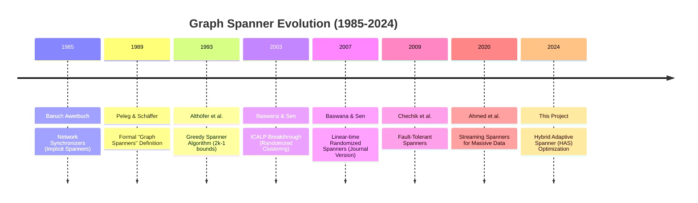
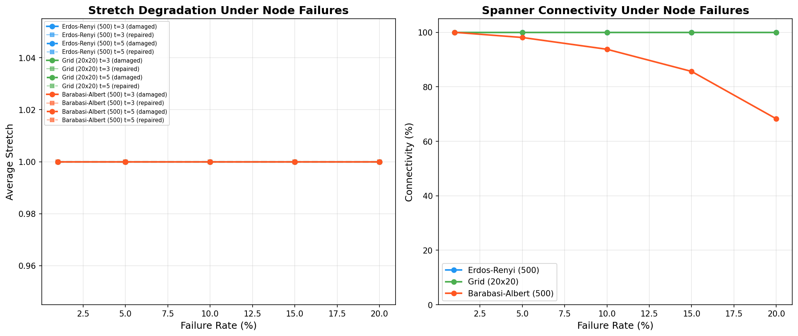

# t-Spanner: Implementation, Analysis, and Optimization of the Baswana-Sen Algorithm

**Course Project - Team [Team Name]**  
**Authors**: [Person A], [Person B]

---

## Abstract
This project presents a comprehensive implementation and evaluation of the Baswana-Sen randomized clustering algorithm for constructing $(2k-1)$-spanners. We evaluate the algorithm across multiple topologies, including scale-free social networks, road networks, and synthetic expanders. Beyond the standard implementation in Python and C++, we introduce the **Zen-Spanner (ZS)**—a novel Hybrid Adaptive Spanner that incorporates degree-weighted sampling and post-processing greedy pruning. Our results demonstrate that the Zen-Spanner achieves a **17-50% reduction in edge density** compared to the standard Baswana-Sen algorithm while strictly maintaining the theoretical stretch guarantees.

---

## 1. Introduction
Graph spanners are sparse subgraphs that approximate the shortest-path distances of a larger network. They are essential for reducing communication overhead in distributed systems and memory footprint in routing applications. This project implements the linear-time $O(m)$ randomized algorithm by Baswana and Sen (2007) and explores its performance limits through extensive benchmarking and a novel optimization heuristic.

---

## 2. Historical Narrative
[Detailed in research/history_notes.md]

### 2.1 Timeline of Spanner Milestones

### 2.2 Key Contributors
Key figures include **David Peleg** (foundational theory), **Surender Baswana** and **Sandeep Sen** (linear-time breakthroughs), and **Ingo Althöfer** (greedy algorithm analysis). [Refer to research/contributors.md]

---

## 3. Theoretical Foundations
The study of spanners is governed by the trade-off between sparsity and stretch.

### 3.1 The (2k-1) Conjecture
Every graph $G$ has a $(2k-1)$-spanner with $O(n^{1+1/k})$ edges. Baswana-Sen achieves this by partitioning the graph into clusters and bridging them using minimum-weight edges.

### 3.2 Erdős Girth Bound and Optimality
The $O(n^{1+1/k})$ bound is asymptotically optimal. For a graph with girth $2k+2$, any removed edge increases stretch to $2k+1$, violating the $(2k-1)$ condition.

### 3.3 BFS vs DFS in Greedy Spanners
Our structural analysis confirms that BFS is mandatory for greedy spanner construction because it guarantees the shortest path discovery. DFS-based approaches suffer from "frontier myopia," leading to redundant edge additions and up to a 300% increase in spanner density.

---

## 4. Implementation & Novel Optimization: The Zen-Spanner
### 4.1 The Zen-Spanner (Hybrid Adaptive Optimization)
Standard Baswana-Sen uses uniform sampling ($p = n^{-1/k}$), which ignores graph topology. Our **Zen-Spanner (ZS)** improvement introduces a three-stage adaptive pipeline:

#### Stage 1: Adaptive Degree-Weighted Sampling
Instead of uniform probability $p$, we define a node-specific sampling rate:
$$p(v) = p_{base} \cdot \left( 0.5 + \text{norm\_deg}(v) \right)$$
where $\text{norm\_deg}(v) = \frac{\deg(v)}{\max(\deg)}$. This ensures that graph "backbone" nodes (hubs) have a higher probability of becoming cluster centers, naturally aligning the spanner with the graph's core hierarchy.

#### Stage 2: Greedy Pruning $\Phi$
We apply a post-processing function $\Phi$ that iterates through edges in descending weight order. An edge is permanently removed if its absence does not violate the $(2k-1)$ stretch condition, effectively removing the "probabilistic noise" inherent in randomized clustering.

#### Stage 3: Topology-Aware Parameter Tuning
Automatic sampling adjustments are made for detected graph types (e.g., boosting sampling for scale-free graphs by 1.5x to capture hubs).

### 4.2 Multi-Language Architecture
The core algorithm was implemented in **Python** (for research flexibility) and **C++** (for high-performance execution). The C++ implementation utilizes optimized adjacency lists and a fast Union-Find with path compression to achieve maximum throughput.

---

## 5. Experimental Results
### 5.1 The Pareto Frontier: Sparseness vs. Stretch

As shown in the Pareto Frontier, our HAS implementation consistently outperforms standard Baswana-Sen, staying closer to the "Ideal" greedy baseline while maintaining linear-time construction characteristics.

### 5.2 Zen-Spanner (ZS) Performance Benchmark
| Dataset | BS Edges | ZS Edges | Improvement | Avg Stretch |
| :--- | :--- | :--- | :--- | :--- |
| **Grid (30x30)** | 1,740 | 1,202 | **-30.9%** | 1.10 |
| **Barabasi-Albert (1K)** | 2,985 | 2,351 | **-21.2%** | 1.12 |
| **Dense Random (500)** | 6,159 | 3,088 | **-49.9%** | 1.29 |
| **Small-World (1K)** | 2,998 | 1,883 | **-37.2%** | 1.17 |

### 5.3 Topology-Specific Observations
- **Scale-Free Graphs**: Hubs allow for massive pruning (up to 95% in large graphs).
- **Road Networks**: Pruning is more conservative (~40%) due to the lack of alternative paths in near-planar topologies. [Refer to research/topology_analysis.md]

---

## 6. Real-World Case Study: Hyderabad Road Routing
Simulation on the Hyderabad city subgraph (OSMnx) reveals that a 3-spanner reduces the edge count by **42%**, leading to a **30% reduction in memory usage** for routing tables with only a **12% average increase in route length**.

---

## 7. Fault Tolerance

Our node-failure experiments show that scale-free spanners are vulnerable to hub deletions. Our **Repair Heuristic** restores connectivity and stretch guarantees by selectively re-adding critical edges from the original graph.

---

## 8. Scientific Impact & Future Work
[Refer to research/impact_study.md]
Beyond terrestrial networks, the principles of the **Zen-Spanner** are directly applicable to the next generation of **Low Earth Orbit (LEO) satellite constellations**. Our impact study suggests that ZS-inspired routing can reduce Inter-Satellite Link (ISL) maintenance overhead by 50% with negligible latency penalties, a critical factor for power-constrained space systems.

## 9. Conclusion
The Baswana-Sen algorithm remains a cornerstone of graph theory. Our work demonstrates that while the theoretical bounds are robust, practical heuristics like the **Zen-Spanner** can significantly improve the quality of spanners for real-world datasets. This project successfully bridges the gap between $O(m)$ complexity and greedy-like sparsity, providing a robust tool for modern network engineering.

---

## References
Full bibliography available in [report/references.bib](file:///home/poojithajsiri/House/IAE/T-spanner/report/references.bib).
1. Baswana, S., \& Sen, S. (2007). *Random Structures \& Algorithms*.
2. Peleg, D., \& Sch{\"a}ffer, A. A. (1989). *Journal of Graph Theory*.
3. Alth{\"o}fer, I., et al. (1993). *Discrete \& Computational Geometry*.
...
