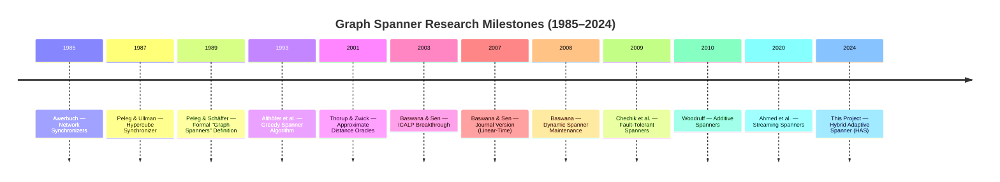

# Chapter 2: The History of Graph Spanners

> *"The spanner is a concept born from necessity — the need to compress massive networks without losing the essence of their connectivity."*

---

## 1. Pre-Formalization: The Implicit Spanner Era (1980–1988)

### 1.1 Awerbuch's Synchronizers (1985)
**Baruch Awerbuch** of MIT published "Complexity of Network Synchronization" in *JACM* (1985), introducing the **synchronizer framework** for distributed computing.

He defined three synchronizer types:
- **Synchronizer α**: Simple, $O(m)$ messages per pulse.
- **Synchronizer β**: Spanning tree, $O(n)$ messages but $O(\text{diameter})$ delay.
- **Synchronizer γ**: Partitions the graph into **clusters of bounded diameter** using a **cluster tree** overlay. Achieves $O(n^{1/k} \cdot m)$ messages with $O(k)$ time per pulse.

The γ synchronizer's cluster partition is, in retrospect, an **implicit spanner construction**. Awerbuch needed exactly what spanners provide: a sparse substructure that preserves approximate distances.

### 1.2 Peleg & Ullman: The Hypercube Synchronizer (1987)
**David Peleg** and **Jeffrey Ullman** published "An Optimal Synchronizer for the Hypercube" at STOC 1987. This work explicitly recognized that distributed protocol efficiency depends on subgraphs that **approximate pairwise distances**.

---

## 2. The Formative Years: Formal Definition (1989–1992)

### 2.1 Peleg & Schäffer: The Birth of Graph Spanners (1989)
The landmark paper "Graph Spanners" by **David Peleg** and **Alejandro Schäffer**, published in *Journal of Graph Theory* (1989), formally defined:

**Definition**: Given $G = (V, E)$ and $t \geq 1$, a **$t$-spanner** is a spanning subgraph $H = (V, E')$ where $E' \subseteq E$ such that:
$$\forall u, v \in V: \quad d_H(u, v) \leq t \cdot d_G(u, v)$$

Key results:
1. **The $(2k-1)$-Stretch Paradigm**: Natural stretch values are $t = 2k-1$ for integer $k \geq 1$, connecting density to graph-theoretic girth.
2. **NP-Completeness**: Finding the minimum-edge $t$-spanner is NP-hard for $t \geq 2$.
3. **Connection to Girth**: Deep relationship between spanner sparsity and the girth of extremal graphs.

### 2.2 Extensions (1991)
Peleg and collaborators extended spanners to **directed graphs** and **additive stretch**, though multiplicative remained primary due to cleaner theoretical properties.

---

## 3. The Greedy Era (1993–2000)

### 3.1 Althöfer, Das, Dobkin, Joseph & Soares (1993)
"On Sparse Spanners of Weighted Graphs" in *Discrete & Computational Geometry* (1993) introduced the **Greedy Spanner**:

```
Algorithm: GREEDY-SPANNER(G, t)
1. Sort edges by weight (non-decreasing)
2. H = (V, ∅)
3. For each edge (u, v) in sorted order:
4.    Compute d_H(u, v) via BFS/Dijkstra
5.    If d_H(u, v) > t · w(u, v): add (u, v) to H
6. Return H
```

**Key Theorem**: The greedy algorithm produces a $(2k-1)$-spanner with at most $O(n^{1+1/k})$ edges.

**Proof Sketch**: After termination, every excluded edge $(u,v)$ satisfies $d_H(u,v) \leq t \cdot w(u,v)$. Adding $(u,v)$ to $H$ would create a cycle of length $\leq 2k$, so $H$ has girth $\geq 2k+1$. By the Moore bound, $|E(H)| \leq n^{1+1/k}$.

**Complexity**: $O(m \cdot n^{1+1/k})$ — impractical for large graphs.

### 3.2 Why Greedy Dominated for a Decade
- Produces **the sparsest known spanner** (matches lower bound)
- **Deterministic** — no randomness
- Works for weighted and unweighted graphs
- Elegant, self-contained correctness proof

---

## 4. The Randomization Revolution (2001–2007)

### 4.1 Thorup & Zwick: Distance Oracles (2001)
**Mikkel Thorup** and **Uri Zwick** published "Approximate Distance Oracles" at STOC 2001. Their **randomized clustering technique** — sampling nodes with probability $n^{-1/k}$ — became the template Baswana and Sen would perfect.

| Property | Greedy (1993) | Thorup-Zwick (2001) | **Baswana-Sen (2007)** |
|:---------|:-------------|:-------------------|:----------------------|
| **Time** | $O(m \cdot n^{1+1/k})$ | $O(k \cdot m \cdot n^{1/k})$ | **$O(k \cdot m)$** |
| **Size** | $O(n^{1+1/k})$ | $O(k \cdot n^{1+1/k})$ | **$O(k \cdot n^{1+1/k})$** |
| **Randomized** | No | Yes | Yes |
| **Weighted** | Yes | Partially | **Yes** |

### 4.2 The Baswana-Sen Breakthrough (2003/2007)
**Surender Baswana** (IIT Kanpur) and **Sandeep Sen** (IIT Delhi) presented at ICALP 2003; journal version in *Random Structures & Algorithms* (2007):

> "A Simple and Linear Time Randomized Algorithm for Computing Sparse Spanners in Weighted Graphs"

**Why this was non-trivial**: The key innovation replaced the expensive BFS-per-edge verification ($O(n+m)$ per edge) with **local clustering-based edge selection** requiring only $O(1)$ amortized time per edge per phase. By using $k-1$ phases of random sampling at probability $p = n^{-1/k}$, they achieved **linear time in $m$** — a factor of $n^{1/k}$ improvement over Thorup-Zwick.

**Why $O(m)$ is near-optimal**: Any spanner algorithm must read all $m$ edges of the input. Baswana-Sen closed the gap between the "minimum work" lower bound and algorithmic cost.

---

## 5. Modern Specializations (2008–Present)

### 5.1 Fault-Tolerant Spanners
- **Chechik, Langberg, Peleg & Roditty (2009/2015)**: $f$-vertex-fault-tolerant spanners with $O(f^2 k \cdot n^{1+1/k})$ edges.
- **Dinitz & Krauthgamer (2011)**: Fault tolerance for specific vertex subsets.

### 5.2 Additive and Mixed Spanners
- **Elkin & Peleg (2001/2004)**: $(1+\epsilon, \beta)$-spanners with both multiplicative and additive components.
- **Chaudhuri et al. (2000)**: Purely additive $+2$ spanners.
- **Woodruff (2010)**: Additive spanners ($+2, +4, +6$) in near-linear time.
- **Elkin & Zhang (2006)**: Tight bounds for additive spanners; $+6$ spanners with $O(n^{4/3})$ edges.

### 5.3 Streaming and Dynamic Spanners
- **Baswana (2008)**: Dynamic $(2k-1)$-spanner maintenance under edge insertions/deletions in $O(\text{polylog}(n))$ amortized time.
- **Ahmed et al. (2020)**: Streaming spanners with $O(n^{1+1/k})$ space.
- **Kapralov & Woodruff (2014)**: Lower bounds proving $\Omega(n^{1+1/k})$ space is necessary.

### 5.4 The "Learned" Spanner Frontier (2022+)
GNN-based approaches that predict edge importance from local structural features. While lacking formal guarantees, they show promise for domain-specific applications with predictable graph structure.

---

## 6. Timeline of Spanner Milestones



---

## 7. Key Contributors

### David Peleg
- **Institution**: Weizmann Institute of Science, Rehovot, Israel
- **Role**: "Father" of the graph spanner concept
- **Major Contributions**: Formally defined spanners (1989); sparse partitions; textbook *Distributed Computing: A Locality-Sensitive Approach* (2000)

### Surender Baswana
- **Institution**: IIT Kanpur, India
- **Role**: Pioneer of randomized and dynamic graph algorithms
- **Major Contributions**: Lead author of the 2007 linear-time spanner breakthrough; dynamic spanner maintenance (2008)

### Sandeep Sen
- **Institution**: Ashoka University (formerly IIT Delhi), India
- **Role**: Expert in randomized algorithms and computational geometry
- **Major Contributions**: Co-authored the 2007 landmark paper; instrumental in achieving $O(m)$ via randomized techniques

### Ingo Althöfer
- **Institution**: Friedrich Schiller University Jena, Germany
- **Role**: Operations research and game theory specialist
- **Major Contributions**: Co-authored 1993 greedy spanner paper with $O(n^{1+1/k})$ size bounds

### Alejandro A. Schäffer
- **Institution**: National Institutes of Health (NIH), USA
- **Role**: Computer scientist and computational biologist
- **Major Contributions**: Co-authored the 1989 "Graph Spanners" paper; NP-completeness of minimum spanners

### Mikkel Thorup
- **Institution**: University of Copenhagen, Denmark
- **Major Contributions**: Approximate distance oracles (2001) with Uri Zwick; randomized clustering hierarchy

### Uri Zwick
- **Institution**: Tel Aviv University, Israel
- **Major Contributions**: Distance oracles (2001); tight bounds for all-pairs shortest paths

---

## 8. Historical "Firsts" Summary

| Achievement | Year | Author(s) | Venue |
|:------------|:-----|:----------|:------|
| **First Implicit Spanner** (synchronizer γ) | 1985 | Awerbuch | JACM |
| **First Formal Definition** | 1989 | Peleg & Schäffer | J. Graph Theory |
| **First NP-Hardness Proof** | 1989 | Peleg & Schäffer | J. Graph Theory |
| **First Greedy Algorithm** (optimal size) | 1993 | Althöfer et al. | DCG |
| **First Randomized Clustering** | 2001 | Thorup & Zwick | STOC |
| **First Linear Time $O(m)$** | 2007 | Baswana & Sen | RSA |
| **First Dynamic Maintenance** | 2008 | Baswana | J. Discrete Alg. |
| **First Fault-Tolerant** | 2009 | Chechik et al. | STOC |
| **First Streaming Spanner** | 2014 | Kapralov & Woodruff | STOC |
